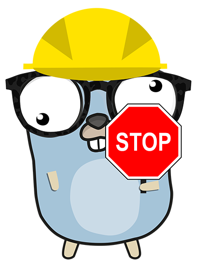

# Stop dispatcher



Stop dispatcher can be used to manage Golang application gracefull shutdown. 
It allow you to register application shutdown callback (to close some database connection, clean temp folder ...)
You can event use it in sub process to manage when operation end up normally or when it failed.

## Installation

`go get -u github.com/gol4ng/stop-dispatcher`

### Examples

A job application (will perfom a task then end)

```go
package main

import (
	"context"
	"fmt"
	"log"

	stop_dispatcher "github.com/gol4ng/stop-dispatcher"
	"github.com/gol4ng/stop-dispatcher/reason_handler"
	"github.com/gol4ng/stop-dispatcher/stop_emitter"
)

func main() {
	// root context
	ctx := context.Background()

	// stop dispatcher with log reason handler
	stopDispatcher := stop_dispatcher.NewDispatcher(
		stop_dispatcher.WithReasonHandler(reason_handler.Log()),
		stop_dispatcher.WithEmitter(
			// Listen SIGINT, SIGTERM
			stop_emitter.DefaultKillerSignalEmitter(),
		),
	)

	// Register a killer signal emitter
	stopDispatcher.RegisterEmitter(
		func(stop func(reason stop_dispatcher.Reason)) {
		    // Start the job 
			for i := 0; i < 10; i++ {
				fmt.Printf("%d time elapsed\n", i)
			}
			// The process is finish so it trigger application stopping 
			stop("process finished")
		},
	)

	// Register all your stopping callback
	stopDispatcher.RegisterCallback(
		stop_dispatcher.CallbackFunc(func(ctx context.Context) error {
            // Do all your cleannup action here
			log.Println("Closing database connection")
			log.Println("Clean temp file")
			return nil
		}),
	)

	// Wait will block until stopping reason was received
	if err := stopDispatcher.Wait(ctx); err != nil {
		log.Printf("error occured during stopping application : %s", err)
	}
	log.Println("Application stopped")
}
```

A runner application (like http server)

```go
package main

import (
	"context"
	"fmt"
	"log"
	"net"
	"net/http"
	"strconv"
	"sync/atomic"

	stop_dispatcher "github.com/gol4ng/stop-dispatcher"
	"github.com/gol4ng/stop-dispatcher/reason_handler"
	"github.com/gol4ng/stop-dispatcher/stop_emitter"
)

func main() {
	// root context
	ctx := context.Background()

	// stop dispatcher with log reason handler
	stopDispatcher := stop_dispatcher.NewDispatcher(
		stop_dispatcher.WithReasonHandler(reason_handler.Log()),
		stop_dispatcher.WithEmitter(
			// Listen SIGINT, SIGTERM
			stop_emitter.DefaultKillerSignalEmitter(),
		),
	)

	i := int64(0)
	httpServer := &http.Server{
		Handler:        http.HandlerFunc(func(writer http.ResponseWriter, request *http.Request) {
			writer.Write([]byte(strconv.Itoa(int(atomic.LoadInt64(&i)))))
			atomic.AddInt64(&i, 1)
		}),
		BaseContext: func(_ net.Listener) context.Context {
			return ctx
		},
	}

	// Register a killer signal emitter
	stopDispatcher.RegisterEmitter(
		// Start the httpServer and listen when it stop
		func(stop func(reason stop_dispatcher.Reason)) {
			if err := httpServer.ListenAndServe(); err != nil && err != http.ErrServerClosed {
				stop(fmt.Errorf("http server[%s] : %w", httpServer.Addr, err))
			}
		},
	)

	// Register all your stopping callback
	stopDispatcher.RegisterCallbacks(
		stop_dispatcher.CallbackFunc(func(ctx context.Context) error {
			return httpServer.Shutdown(ctx)
		}),
		stop_dispatcher.CallbackFunc(func(ctx context.Context) error {
			log.Println("Closing all database connection")
			return nil
		}),
	)

	// Wait will block until stopping reason was received
	if err := stopDispatcher.Wait(ctx); err != nil {
		log.Printf("error occured during stopping application : %s", err)
	}
	log.Println("Application stopped")
}
```
